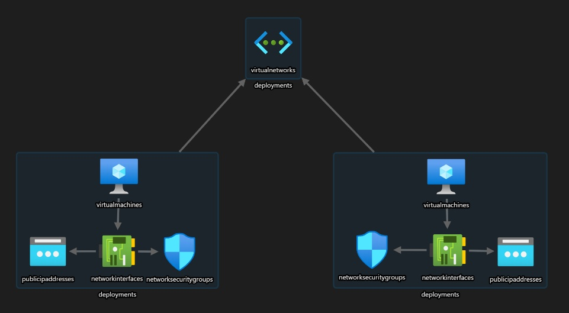

# [szkchm-az303-zad2](https://github.com/bpelikan/SzkolaChmury/tree/az303/zadanie2/Azure/Architecture/Az-303/Zadanie3)


<a href="https://portal.azure.com/#create/Microsoft.Template/uri/https%3A%2F%2Fraw.githubusercontent.com%2Fbpelikan%2Fszkchm-az303-zad2%2Fmain%2Fazuredeploy.json" target="_blank">
  
</a>



### 1. Create Resource Group
```bash
# resource group for deployment
RG_NAME="cl1-prod-rg"
LOCATION="westeurope"
az group create --name $RG_NAME --location $LOCATION
```

### 2. Create Key Vault and secrets
```bash
RG_NAME_VAULT="cl1-prod-kv-rg"
VAULT_NAME="cl1-prod-szkchm-we-kv"
ADMIN_LOGIN="vmadminlogin$RANDOM"
ADMIN_PASS="AdminPassword$RANDOM"
az group create --name $RG_NAME_VAULT --location $LOCATION
az keyvault create --location $LOCATION --name $VAULT_NAME --resource-group $RG_NAME_VAULT
az keyvault update --name $VAULT_NAME --resource-group $RG_NAME_VAULT --enabled-for-template-deployment true

az keyvault secret set --name "vmAdminUsername" --vault-name $VAULT_NAME --value $ADMIN_LOGIN
az keyvault secret set --name "vmAdminPassword" --vault-name $VAULT_NAME --value $ADMIN_PASS
```

### 3. Deploy using CLI
```bash
git clone https://github.com/bpelikan/szkchm-az303-zad2.git
cd szkchm-az303-zad2
az deployment group validate --resource-group $RG_NAME --template-file azuredeploy.json --parameters azuredeploy.parameters.json
az deployment group create --resource-group $RG_NAME --template-file azuredeploy.json --parameters azuredeploy.parameters.json
```

---

### GitHub Actions configuration
```bash
# settings -> secrets -> create secret AZURE_SUBSCRIPTION_ID with value from $SUBSCRIPTION_ID
SUBSCRIPTION_ID=$(az account show -o json | jq -r ".id")

# save json from output and save in secret AZURE_CREDENTIALS
az ad sp create-for-rbac --name "szkchm-az303-zad2" --role contributor \
                          --scopes /subscriptions/$SUBSCRIPTION_ID \
                          --sdk-auth
```
